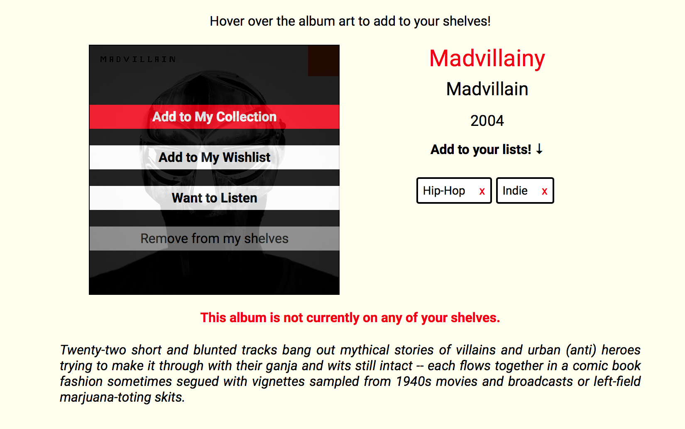
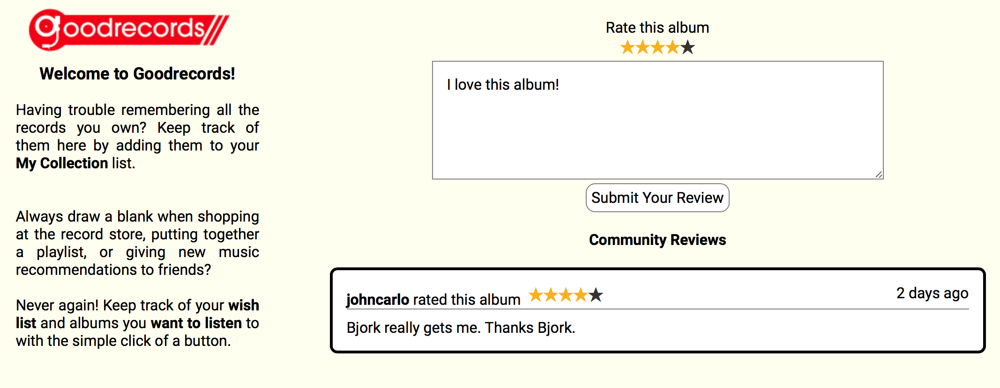
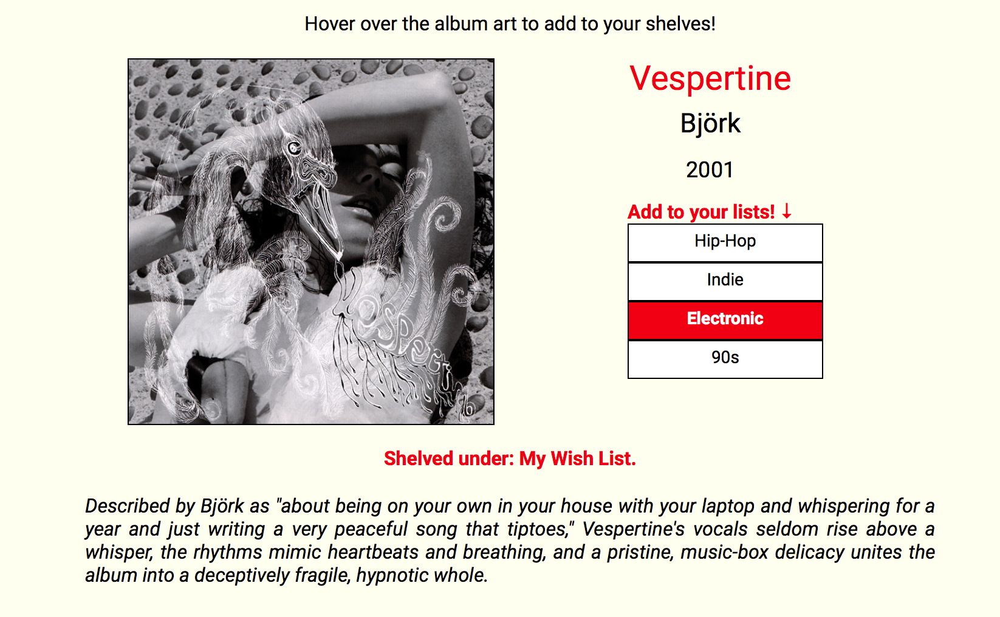

# GoodRecords

[Goodrecords live][heroku]

[heroku]: http://goodrecords.herokuapp.com'

Goodrecords is a full-stack web application that drew inspiration from Goodreads. Users can keep track of their record collection, maintain a wishlist, and keep a list of albums they would like to listen to.  Users also have the ability to create their own custom lists and add albums to those lists. In addition, users can review and rate albums, and view other users' reviews.

It was built using:
- _Ruby on Rails_ on the backend,
- _PostgreSQL_ for the database, and
- _React.js_ with a _Redux_ framework for the frontend.  

## Features and Implementation

### Album Index Page

Albums are stored in the database, with columns for id, artist, title, image_url, description, and year.  Albums are rendered in two different components: an index page showing multiple albums, and a show page showing the details of the album.

When a user logs in, she is automatically directed to the album index page, which shows a set amount of albums in the database by default.  When a user clicks on the sidebar buttons, the album index page is re-rendered to show only those albums contained in that specific shelf.

When a user clicks on a shelf, the appropriate sidebar item is highlighted, so the user knows which shelf she is currently browsing.  When the user clicks on a specific album and leaves the index page, the sidebar highlighting is removed.

#### Shelves
A user by default has three shelves on which they can place albums -- My Collection, My Wish List, and Want to Listen.  The shelf relationship is stored in the join table "album_statuses", which joins the user and album by id, and also contains a "status" column representing which of the three shelves the album is currently on, if any.  Inclusion in the status column is limited to three specific strings representing the three shelves.

#### Custom User Lists
Users can also create their own custom lists which have the same functionality as the shelves described above.  The lists can be created using a form contained in the bottom sidebar box, and once created, the list immediately renders below.  The lists can similarly be deleted by clicking the "x" and the sidebar immediately rerenders to remove the list.

The relationships between users, albums, and custom lists are stored in the database via two join tables with a "tags" and "taggings" structure.

### Album Detail Page

At the album detail page, the user can hover over the album art to add or remove the album from their shelves.  When an album's shelf status is changed, the buttons are re-rendered, enabled/disabled, and colored/highlighted appropriately.  The text stating the shelf status is also immediately updated.

#### Reviews

Users can create reviews and view other people's reviews of the album.  Users can click on the stars to rate the album, and input their review into a text field.  Upon submit, the review is automatically rendered on the page.  A user can edit and delete the review without leaving the album detail page -- only that portion of the page changes.

#### Add to list

There is also a hover-dropdown on the album detail page where users can add the album to the custom lists they have created.  

## Future Directions for the Project

I plan to add the following features to the project.

### Search

Searching for items is a standard feature of Goodreads.  I plan to implement a search bar that creates a dropdown of the first 5 matching results.  Upon submit, the album index page will re-render with the matching albums.

### Add albums

I plan to implement the ability for the user to create albums in the database, with the ability to upload the album's cover art. I plan to use Cloudinary or a similar service to store these images.  
